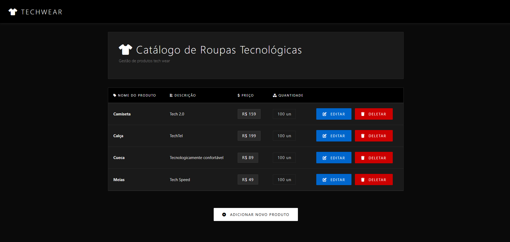
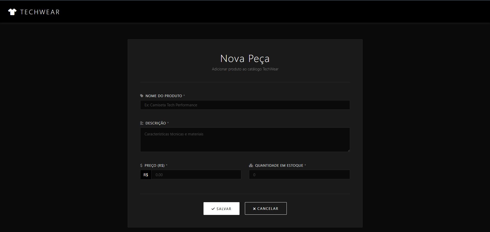
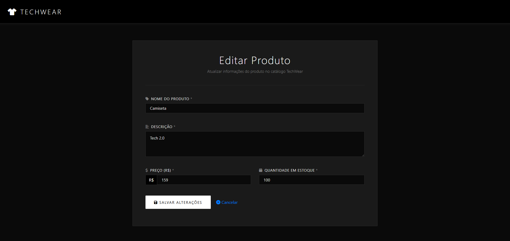
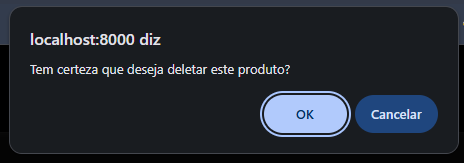

# 🛍️ TechWear Store - CRUD em Go

Sistema de gerenciamento de produtos para loja de roupas tecnológicas desenvolvido em Go com interface web moderna e minimalista.



## 📋 Sobre o Projeto

TechWear Store é um sistema CRUD (Create, Read, Update, Delete) completo para gerenciamento de catálogo de produtos. O projeto utiliza Go puro no backend com templates HTML, PostgreSQL como banco de dados, e uma interface dark mode moderna com Bootstrap e Font Awesome.

## ✨ Funcionalidades

### 📊 Listagem de Produtos
- Visualização de todos os produtos em formato de tabela
- Exibição de informações: Nome, Descrição, Preço e Quantidade em Estoque
- Botões de ação (Editar e Deletar) para cada produto
- Design responsivo e minimalista


### ➕ Adicionar Produto
- Formulário intuitivo para cadastro de novos produtos
- Campos obrigatórios validados:
  - Nome do Produto
  - Descrição
  - Preço (R$)
  - Quantidade em Estoque
- Validação de tipos de dados no backend
- Botões de Salvar e Cancelar



### ✏️ Editar Produto
- Formulário pré-preenchido com dados atuais do produto
- Atualização de todas as informações do produto
- Validação de dados no backend
- Confirmação de alterações



### 🗑️ Deletar Produto
- Confirmação de exclusão via modal JavaScript
- Exclusão permanente do banco de dados
- Redirecionamento automático após exclusão



## 🏗️ Arquitetura do Projeto

```
store/
├── main.go                 # Ponto de entrada da aplicação
├── go.mod                  # Gerenciamento de dependências
├── controllers/            # Lógica de controle das rotas
│   └── product_controller.go
├── models/                 # Modelos de dados e operações no BD
│   └── product.go
├── db/                     # Configuração do banco de dados
│   └── db.go
├── routes/                 # Definição de rotas
│   └── routes.go
├── templates/              # Templates HTML
│   ├── _head.html         # Partial: Head comum
│   ├── _menu.html         # Partial: Menu de navegação
│   ├── index.html         # Página principal
│   ├── add_product.html   # Página de adicionar
│   └── edit_product.html  # Página de editar
└── static/                 # Arquivos estáticos
    └── style.css          # Estilos CSS centralizados
```

## 🛠️ Tecnologias Utilizadas

### Backend
- **Go 1.x** - Linguagem de programação
- **net/http** - Servidor HTTP nativo
- **html/template** - Renderização de templates
- **database/sql** - Interface de banco de dados
- **lib/pq** - Driver PostgreSQL

### Frontend
- **HTML5** - Estrutura
- **CSS3** - Estilização personalizada
- **Bootstrap 4.3.1** - Framework CSS
- **Font Awesome 6.0** - Ícones
- **JavaScript** - Interações dinâmicas

### Banco de Dados
- **PostgreSQL** - Banco de dados relacional

## 🚀 Como Executar

### Pré-requisitos

- Go 1.16 ou superior instalado
- PostgreSQL instalado e rodando
- Git (opcional)

### 1. Clone o Repositório

```bash
git clone https://github.com/vilar95/go-packages.git
cd go-packages/store
```

### 2. Configure o Banco de Dados

Crie o banco de dados PostgreSQL:

```sql
CREATE DATABASE insider_store;
```

Crie a tabela de produtos:

```sql
CREATE TABLE products (
    id SERIAL PRIMARY KEY,
    name VARCHAR(255) NOT NULL,
    description TEXT NOT NULL,
    price DECIMAL(10, 2) NOT NULL,
    quantity INTEGER NOT NULL
);
```

### 3. Configure a Conexão

Edite o arquivo `db/db.go` com suas credenciais do PostgreSQL:

```go
connection := "user=postgres dbname=insider_store password=sua_senha host=localhost port=5432 sslmode=disable"
```

### 4. Instale as Dependências

```bash
go mod download
```

### 5. Execute a Aplicação

```bash
go run main.go
```

A aplicação estará disponível em: **http://localhost:8000**

## 📡 Rotas da Aplicação

| Método | Rota | Descrição |
|--------|------|-----------|
| GET | `/` | Lista todos os produtos |
| GET | `/add-product` | Exibe formulário de adicionar |
| POST | `/insert-product` | Insere novo produto |
| GET | `/edit-product?id={id}` | Exibe formulário de edição |
| POST | `/update-product` | Atualiza produto existente |
| GET | `/delete-product?id={id}` | Deleta produto |
| GET | `/static/*` | Serve arquivos estáticos |

## 💾 Modelo de Dados

### Product

```go
type Product struct {
    Id          int
    Name        string
    Description string
    Price       float64
    Quantity    int
}
```

## 🎨 Design e Interface

### Características do Design

- **Dark Mode**: Interface escura moderna (#0a0a0a)
- **Minimalismo**: Design limpo e focado na funcionalidade
- **Tipografia**: Segoe UI, Roboto com letter-spacing aumentado
- **Cores de Ação**:
  - Branco (#ffffff) - Ações primárias
  - Azul (#0066cc) - Editar
  - Vermelho (#cc0000) - Deletar
- **Responsividade**: Layout adaptável para diferentes telas
- **Acessibilidade**: Contraste adequado e ícones descritivos

### Componentes Reutilizáveis

- **_head.html**: Metadados, links CSS e JS
- **_menu.html**: Barra de navegação TechWear
- **style.css**: Estilos globais unificados

## 🔧 Funcionalidades Técnicas

### Validação de Dados

- Validação de tipos no backend (string → float64, string → int)
- Campos obrigatórios no frontend
- Tratamento de erros com mensagens apropriadas

### Segurança

- Prepared statements para prevenir SQL Injection
- Validação de entrada de dados
- Confirmação de ações destrutivas

### Performance

- Conexão com banco de dados sob demanda
- Fechamento adequado de conexões (defer)
- Templates pré-compilados


